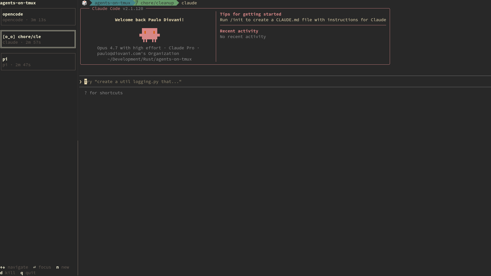

# Agents on TMUX

A TMUX-based AI Agents orchestrator.

<p align="center">
  
</p>


> [!NOTE]
> The project is in early development and subject to change or evolve. Expect new features soon.

## Design

`agents-on-tmux`, or just `aot`, works as a thin wrapper over tmux and a TUI control panel. Its features are divided into three primary modules:

- `tui` The terminal interface provides a control panel for running agents, including actions to focus, stop, or start a new agent.
  The TUI run on its own TMUX pane, window, or popup, it does not highjack or wrap your terminal to run agents inside its interface.
  - Windows are organized into two tabs: **Agents** (running AI coding agents) and **Windows** (regular tmux windows).
- `tmux` The TMUX communication interface, allowing to start and control a dedicated TMUX session.
- `agents` The `agents` interface, supporting popular terminal-based AI Agents and interact with them.

### Architecture

```
┌──────────────────────────────────────────────────────────────────┐
│                          aot (main.rs)                           │
├──────────────────────────────┬───────────────────────────────────┤
│         frontends/           │            backends/              │
│                              │                                   │
│       ┌────────────┐         │         ┌────────────┐            │
│       │    tui     │         │         │    tmux    │            │
│       └────────────┘         │         └────────────┘            │
│                              │         ┌────────────┐            │
│                              │         │   agents   │            │
│                              │         └────────────┘            │
└──────────────────────────────┴───────────────────────────────────┘

┌──────────────────────────────────────────────────────────────────┐
│                      Parent TMUX Session                         │
│  ┌────────────┐   ┌──────────────────────────────────────────┐   │
│  │  TUI Pane  │   │  Nested: agents-on-tmux Session          │   │
│  │            │   │   ┌──────────┐ ┌──────────┐ ┌──────────┐ │   │
│  │            │   │   │  Agent   │ │  Agent   │ │  Agent   │ │   │
│  │            │   │   │  Window  │ │  Window  │ │  Window  │ │   │
│  │            │   │   └──────────┘ └──────────┘ └──────────┘ │   │
│  └────────────┘   └──────────────────────────────────────────┘   │
└──────────────────────────────────────────────────────────────────┘
```

## Requirements

- [TMUX](https://tmux.app/)

Optional dependencies:

- [Nerd Font](https://www.nerdfonts.com/) 3+ for agent icons. Enable with `NERD_FONT=1`.
- [Font Awesome](https://fontawesome.com/) 7+ for agent icons. Enable with `FONT_AWESOME=1`.

When both icon fonts are enabled, Nerd Font custom icons take precedence.

Also check the [Recommended TMUX Config settings](./docs/recommended-tmux-config.md).

## How does it work

1. Start the application with `aot`.
1. The application checks if a parent TMUX session is running or stops if not.
1. Start a new dedicated TMUX session named `agents-on-tmux`, this is the session that will host the agents.
1. The TUI control panel is started by default on a left panel. Can also be started with `aot --tui`.
1. User can interact with the dedicated session using the TUI control or standard TMUX mappings.

## Screencast

https://github.com/user-attachments/assets/e85bea40-2204-4f9d-9644-72dfd7c74dce

## Supported Agents

| AI Agent    | Detect | Listen | Remote Control |
| :---------- | :----: | :----: | :------------: |
| Aider       |   ✔️   |   -    |       -        |
| Claude Code |   ✔️   |   -    |       -        |
| Codex       |   ✔️   |   -    |       -        |
| Cursor      |   ✔️   |   -    |       -        |
| Devin       |   ✔️   |   -    |       -        |
| Hermes      |   ✔️   |   -    |       -        |
| OpenCode    |   ✔️   |   -    |       -        |
| Pi          |   ✔️   |   -    |       -        |
