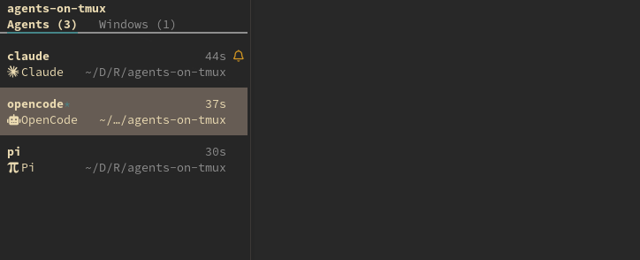

# Agents on TMUX

A TMUX-based AI Agents orchestrator.

<p align="center">
  
</p>


> [!NOTE]
> The project is in early development and subject to change or evolve. Expect new features soon.

## Design

`agents-on-tmux`, or just `aot`, works as a thin wrapper over tmux and a TUI control panel. Its features are divided into three primary modules:

- `tui` The terminal interface provides a control panel for running agents, including actions to focus, stop, or start a new agent.
  The TUI run on its own TMUX pane, window, or popup, it does not highjack or wrap your terminal to run agents inside its interface.
  - Windows are organized into two tabs: **Agents** (running AI coding agents) and **Windows** (regular tmux windows).
- `tmux` The TMUX communication interface, allowing to start and control a dedicated TMUX session.
- `agents` The `agents` interface, supporting popular terminal-based AI Agents and interact with them.

### Architecture

```
┌──────────────────────────────────────────────────────────────────┐
│                          aot (main.rs)                           │
├──────────────────────────────┬───────────────────────────────────┤
│         frontends/           │            backends/              │
│                              │                                   │
│       ┌────────────┐         │         ┌────────────┐            │
│       │    tui     │         │         │    tmux    │            │
│       └────────────┘         │         └────────────┘            │
│                              │         ┌────────────┐            │
│                              │         │   agents   │            │
│                              │         └────────────┘            │
└──────────────────────────────┴───────────────────────────────────┘

┌──────────────────────────────────────────────────────────────────┐
│                      Parent TMUX Session                         │
│  ┌────────────┐   ┌──────────────────────────────────────────┐   │
│  │  TUI Pane  │   │  Nested: agents-on-tmux Session          │   │
│  │            │   │   ┌──────────┐ ┌──────────┐ ┌──────────┐ │   │
│  │            │   │   │  Agent   │ │  Agent   │ │  Agent   │ │   │
│  │            │   │   │  Window  │ │  Window  │ │  Window  │ │   │
│  │            │   │   └──────────┘ └──────────┘ └──────────┘ │   │
│  └────────────┘   └──────────────────────────────────────────┘   │
└──────────────────────────────────────────────────────────────────┘
```

## Requirements

- [TMUX](https://tmux.app/)

Optional dependencies:

- [Nerd Font](https://www.nerdfonts.com/) 3+ for agent icons
- [Font Awesome](https://fontawesome.com/) 7+ for agent icons

When both icon fonts are enabled, Nerd Font custom icons take precedence.

Also check the [Recommended TMUX Config settings](./docs/recommended-tmux-config.md).

### Dev Dependencies

Required only to build from source:

- [Rust](https://www.rust-lang.org/) 1.85+ (edition 2024)

## Install

Build and install the `aot` binary from source:

```sh
cargo install --path .
```

## Configuration

`aot` supports configuration via CLI arguments, environment variables, and a TOML config file.

**Priority chain:** CLI arguments > environment variables > config file > defaults

### Config File

Create `~/.config/aot/aot.conf` to set default values:

```toml
tui = false
no_tui = false
nerd_font = true
font_awesome = true
accent_color = "blue"
selection_bg = "dark_gray"
```

All fields are optional. Omitted boolean fields use their defaults (`false`).

#### Colors

`aot` never picks absolute colors: it styles itself with your terminal's own
16-color palette and with bold/dim attributes, so it follows your terminal theme.
Only these two slots are configurable, and both take a color name:
`black`, `red`, `green`, `yellow`, `blue`, `magenta`, `cyan`, `gray`,
`dark_gray` (alias `bright_black`), `light_red`/`bright_red`, `light_green`,
`light_yellow`, `light_blue`, `light_magenta`, `light_cyan`, `white`.

| Option | Description |
|--------|-------------|
| `accent_color` | The active-window marker (`*`) and the tab underline. Defaults to `blue`. |
| `selection_bg` | Background of the selected row. Defaults to `dark_gray` (bright black). Set it to `"reversed"` to invert the row instead, for themes where bright black is indistinguishable from the background. |

### CLI Arguments

| Flag | Description |
|------|-------------|
| `--tui` | Launch only the terminal UI |
| `--no-tui` | Do not launch the terminal UI pane |
| `--nerd-font[=true\|false]` | Enable Nerd Font icons |
| `--font-awesome[=true\|false]` | Enable Font Awesome icons |

### Environment Variables

| Variable | Description |
|----------|-------------|
| `NERD_FONT` | Enable Nerd Font icons (`1`, `true`, `yes`, `on`) |
| `FONT_AWESOME` | Enable Font Awesome icons (`1`, `true`, `yes`, `on`) |

## How does it work

1. Start the application with `aot`.
1. The application checks if a parent TMUX session is running or stops if not.
1. Start a new dedicated TMUX session named `agents-on-tmux`, this is the session that will host the agents.
1. The TUI control panel is started by default on a left panel. Can also be started with `aot --tui` or skipped with `aot --no-tui`.
1. User can interact with the dedicated session using the TUI control or standard TMUX bindings.

## Screencast

https://github.com/user-attachments/assets/e85bea40-2204-4f9d-9644-72dfd7c74dce

## Supported Agents

| AI Agent    | Detect | Listen | Remote Control |
| :---------- | :----: | :----: | :------------: |
| Aider       |   ✔️   |   -    |       -        |
| Claude Code |   ✔️   |   -    |       -        |
| Codex       |   ✔️   |   -    |       -        |
| Copilot     |   ✔️   |   -    |       -        |
| Cursor      |   ✔️   |   -    |       -        |
| Devin       |   ✔️   |   -    |       -        |
| Hermes      |   ✔️   |   -    |       -        |
| OpenCode    |   ✔️   |   -    |       -        |
| Pi          |   ✔️   |   -    |       -        |
